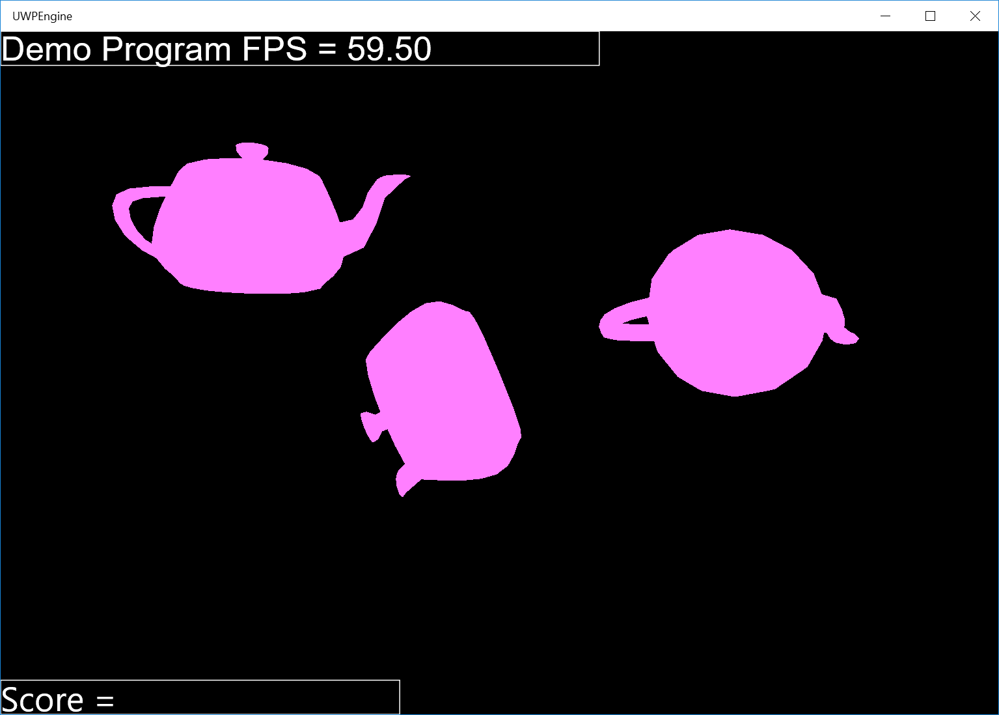
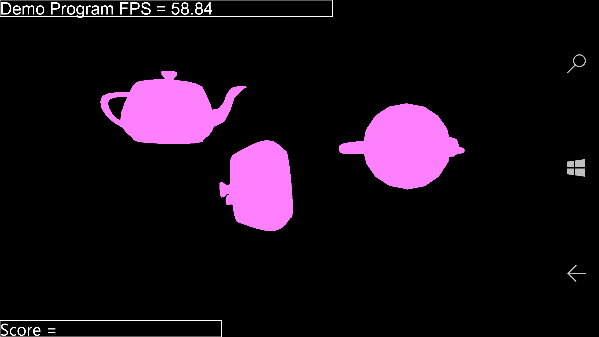

# UWPEngine

This project aims to build a simple rendering engine for future use, such as 3D game projects. This program can be used on various Windows 10 platforms, including Windows 10 Mobile and Windows 10 PC. Direct X 11, Universal Windows Platform framework and Visual Studio (C++) were used to develop this engine. In particular, this program was built from scratch, which means no other third-party libraries were used. The engine can read object model files (.obj) and render them.

The goal of this program is to learn how DirectX 11 works and 3-D graphics can be implemented.

